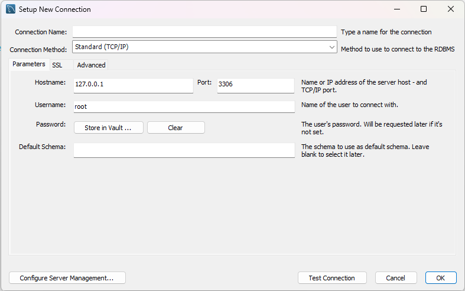

# NOTE FOR FINAL PROJECT INTRO-SOFTWARE

### Mục lục

1. [Set up môi trường](#h_1)
2. [Set up cơ sở dữ liệu](#h_2)
3. [Quy trình làm việc](#h_3)

<h2 id = "h_1">1. Set up môi trường</h2>

- Các thư viện cần cài đặt trong Eclipse (_có sẵn trong folder src/lib_):
  - JavaFX
  - JavaFX dialogs
  - MySQL-connector-j (for Java)

Chuột phải tên Project > _**Build Path**_ > _**Configure build path**_


- Thêm đường dẫn tới folder `JavaFX SDK/lib `
  1.  Chuột phải ở tên Project
  2.  Chọn _**Run as**_> _**Run Configuration**_ > _**Arguments**_
  3.  Thêm đường dẫn tới folder lib


<h2 id = "h_2">2. Setup cơ sở dữ liệu</h2>

- Tạo một connection mới trong MySQL Wordkbench



- Thay đổi thông tin connection trong file `src/application/database/ConnectDatabase.java`

```java
Connection con = DriverManager.getConnection("jdbc:mysql://localhost:<port_number>/cnpm", "root", <connection_password>);
```

- Mở file `src/Data.sql` trong MySQL Wordkbench, và **Execute**

<h2 id = "h_3">3. Quy trình làm việc</h2>

- Clone repo về local device

```shell
git clone https://github.com/becacabe2002/Software_Intro.git
```

- Import Project vừa được clone về: _**File**_ > _**Open Project from file system**_

- Tạo một branch mới

```shell
git checkout -b <new_branch>
```

- Chỉnh sửa code
- Thêm phần chỉnh sửa vào branch

```shell
git add [./--all]
```

- Ghi chú các phần thay đổi

```shell
git commit -m  "Nội dung thay đổi"
```

- Push lên remote branch

```shell
git push -u origin <branch_name>
```

- Tạo pull request to branch `master`
